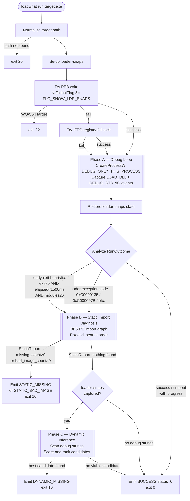
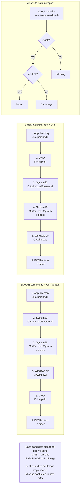
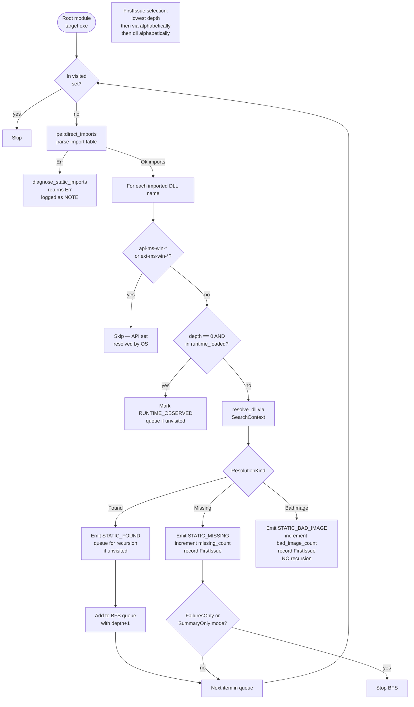
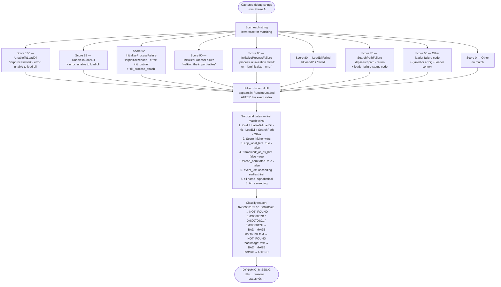
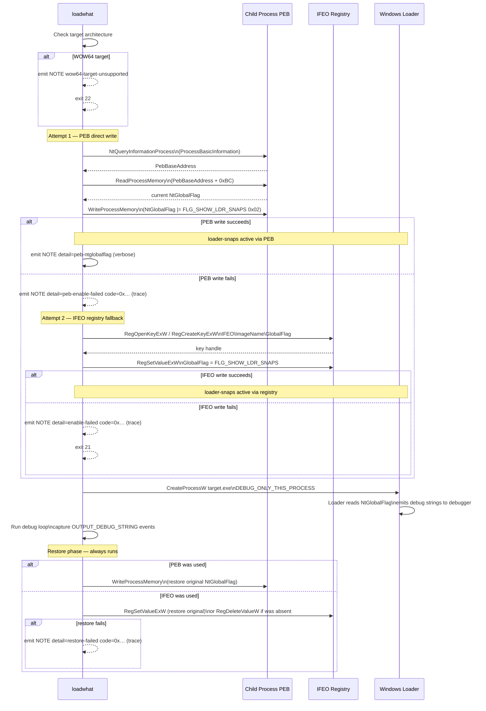

# loadwhat Diagrams

## 1. Phase Flow Diagram

---

## 2. DLL Search Order

---

## 3. BFS Import Walk (Phase B)

---

## 4. Dynamic Candidate Scoring (Phase C)

---

## 7. Loader-Snaps Enable Sequence

